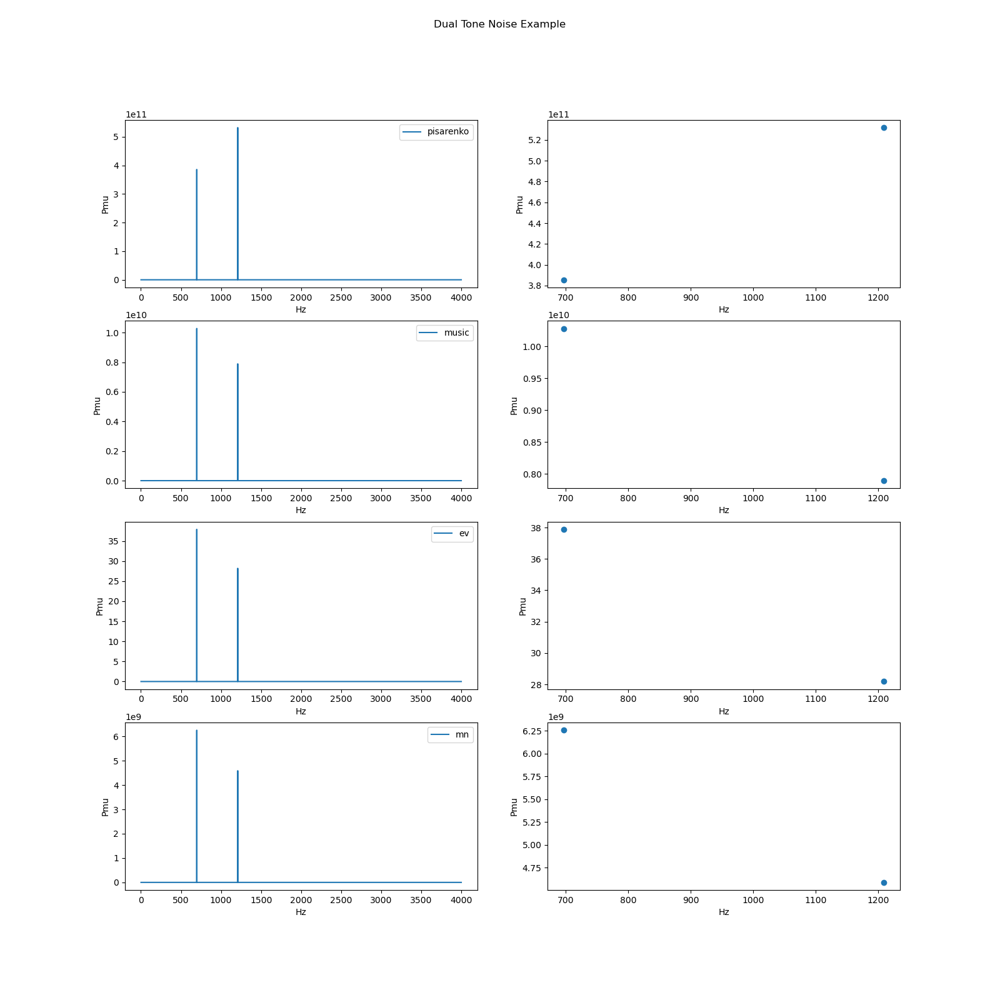

# libmusic_py

This is a reimplementation of
[libmusic_m](https://github.com/dataandsignal/libmusic_m) in python. I tested
with the lm_single_tone_noise.m lm_dual_tone_noise.m example files, but haven't
gone through all the tests for libmusic_m so there may be bugs. I also didn't
reimplement some of the plotting capability in libmusic_m. Pull requests welcome.

Based on the two examples everything nominally works, but if you encounter a bug
it is likely due to my reimplementation and not the original libmusic_m so
please do **NOT** file issues against libmusic_m.

This is a Python implementation of spectral methods based on signal space
decomposition. The idea behind those methods is to decompose noisy signal into
pure signal and noise. Methods provided here are:
- MUSIC (and special case of Pisarenko)
- EV
- Minimum Norm




You will find examples in **examples** folder and tests in **tests** (work in
progress) folder. There is also specific support for DTMF (dual tone signals),
including a toy testing framework for them. Just ignore them or reuse that for
your own purposes.

# Using in Python
1. install libmusic, `python -m pip install .`
2. Create a method object

```python
from libmusic_py import lm_spectral_method
lm = lm_spectral_method(kind, M, 2*P)
```

where <b>kind</b> is one of `pisarenko/music/ev/mn`, <b>M</b> is autocorrelation
order and <b>P</b> is number of real signal sources.

1. Process input samples and optionally capture the intermediate results (all
   eigenvectors, signal eigenvectors, noise eigenvectors, eigenvalues,
   autocorrelation matrix)

```python
Vy,Vx,Ve,A,Ry = lm.process(y)
```

4. Compute full PSD for frequencies 1 - 4000 Hz (sampling rate is 8 kHz)

```python
s = np.linspace(1, 4000, 4000, endpoint=True)
X2,d2 = lm.psd(method, f, 8000)
plt.figure()
plot(f,X2)
```

TODO add plot from python     
<!--  -->


5. Get frequency components by eigenrooting (roots of the Z-transforms of noise
   eigenvectors)

```python
fs = lm.eigenrooting(Fs, 0, 0)
```


6. Get detected frequencies by peak searching (considering only these
   frequencies that are passed in fs). peakWidth is a width of a peak, use 0 for
   default

```python
peaks, pmu = lm.peaks(fs, Fs, peakWidth)
```


7. In case of 1 or 2 sinusoids, get amplitudes by correlation method

```python
A = lm.single_tone_amplitude()
A = lm.dual_tone_amplitude(f1, f2, Fs)
```

8. In case of any number of sinusoids, get all amplitudes (for each frequency component given in fs)

```python
A = lm.solve_for_amplitudes(fs, Fs)
```


Copyright (C) 2022, Piotr Gregor piotr@dataandsignal.com


## Performance in noise

In a noisy environment, MUSIC performs well as long as SNR is above 66.53 dB.


## Applications

In telephony, DTMF symbols must be removed from stream, due too sensitive data
protection. Often though, fractions of those DTMFs are left in a stream and must
be removed. This cannot be done with Goertzel algorithm as it needs more than
110 samples to achieve right frequency resolution, to be able to detect DTMF
frequencies. An example of such DTMF fraction is shown on the picture. This one
is 14 samples in length (1.75 ms at a sampling rate of 8000 Hz).

TODO
<!--  -->

With MUSIC, samples requirement is reduced from 110 to 8 and frequency
resolution (accuracy) increased from 72.73 Hz to 10^-2 Hz in the same time. This
picture presents correctness as a percentage of detected fractions of dual tone
signals (DTMFs), by input vector length **N** (8,9,10,11,12,14), autocorrelation
order **M** (4-8) and fraction length **L** (8-28 samples).

TODO
<!--  -->


For example, using a block of N=12 samples, all fractions of length L=10 and
above can be detected (with autocorrelation order M={6,7}). N=8 detects all
fractions longer than 8 samples (1 ms) with M=4.


## C library

A C library built on libmusic_m's results is [libmusic](https://github.com/dataandsignal/libmusic)


## Repository 

URL: https://github.com/tkuraku/libmusic_py


## Further reading, references

A good references about spectral analysis and space decomposition methods are:

- Hayes M. H., Statistical Digital Signal Processing And Modeling, Georgia
  Institute of Technology, Wiley, 2008
- Lawrence Marple S. Jr., Digital Spectral Analysis, Dover Publications, 2019
- Schmidt R. O., Multiple Emitter Location and Signal Parameter Estimation, IEEE
  Transactions on Antennas and Propagation, Vol. AP-34, No. 3, 1986

These references are missing though (or skipping intentionally) a crucial result
about autocorrelation and sinusoids embedded in a vector space whose elements
are shifted samples of that same sinusoid (with all the phases). This is a
fundamental finding space decomposition methods are built on.

This is explained in more detail in:

- Penny W. D., Signal Processing Course, University College London, 2000

- Piotr Gregor's [engineering
  thesis](https://drive.google.com/file/d/1dfen9z3E5YuNjXSm3PTG00R4N38hmIMR/view?usp=sharing)
  (written in polish, probably will be translated to english) 


## Copyright 

LIBMUSIC

Copyright (C) 2018-2022, Piotr Gregor piotr@dataandsignal.com

August 2022

2024 Trevor Clark Conversion to Python

